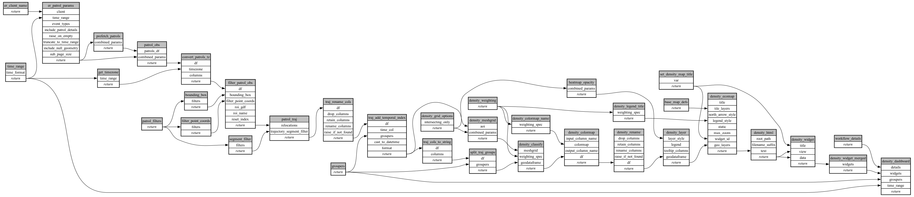

```
# AUTOGENERATED BY ECOSCOPE-WORKFLOWS; see fingerprint in README.md for details

```

```yaml
# fingerprint:
artifacts_sha256_basic: c1796ee0dbe541a4a3bc626e67b7758c97eccc9f4aa1ca48983a840ad1f2413b
artifacts_sha256_strict: fef4f06ea8cc58d6fd4a872b7989ed2cab3e14d0a23e59fb03528a3094c4237f
installed_requirements:
- channel: https://repo.prefix.dev/ecoscope-workflows/
  name: ecoscope-platform
  version: {version: ==2.17.3}
- channel: https://repo.prefix.dev/ecoscope-workflows-custom/
  name: ecoscope-workflows-ext-custom
  version: {version: ==0.1.0rc18}
- channel: conda-forge
  name: pydeck
  version: {version: ==0.9.2}
params_sha256: b23e68a1b978970092489f7513b11caee979c2e614fb4a65a4484dafcd63ec9a
spec_sha256: 2027a5be97294c3606ea0f570d3f1b13d1af54a27520f6cddc08085bcd12d1b1

```

# ecoscope-workflows-patrol-track-density-map-workflow


